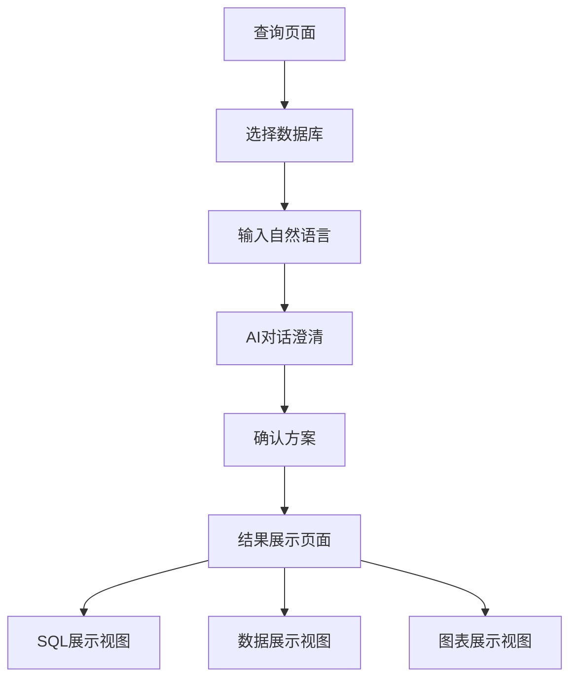

## 1. 产品概述
这是一个基于自然语言的数据库查询和图表生成工具。用户可以通过自然语言与AI对话，自动生成SQL查询语句并创建可视化图表。产品解决了非技术用户难以编写SQL查询和制作数据图表的问题，让数据分析变得更加简单直观。

目标用户包括数据分析师、业务人员、产品经理等需要快速获取数据洞察的专业人士。

## 2. 核心功能

### 2.1 用户角色
| 角色 | 注册方式 | 核心权限 |
|------|----------|----------|
| 普通用户 | 邮箱注册 | 可使用自然语言查询、生成图表、查看SQL语句 |
| 高级用户 | 邀请码升级 | 额外享有保存查询历史、导出图表等高级功能 |

### 2.2 功能模块
产品包含以下核心页面：
1. **查询页面**：数据库选择、自然语言输入、AI对话界面
2. **结果展示页面**：SQL语句展示、数据表格展示、ECharts图表展示

### 2.3 页面详情
| 页面名称 | 模块名称 | 功能描述 |
|----------|----------|----------|
| 查询页面 | 数据库选择器 | 选择目标数据库连接，支持多数据库类型 |
| 查询页面 | 自然语言输入框 | 输入查询需求的自然语言描述 |
| 查询页面 | AI对话区域 | 显示AI理解结果和建议，支持多轮对话澄清 |
| 查询页面 | 确认按钮 | 确认AI生成的查询方案 |
| 结果展示页面 | SQL展示模块 | 点击按钮展示后端返回的完整SQL语句，支持语法高亮 |
| 结果展示页面 | 数据展示模块 | 点击按钮以表格形式展示后端返回的X轴、Y轴数据 |
| 结果展示页面 | 图表展示模块 | 点击按钮使用ECharts渲染可视化图表，支持多种图表类型 |
| 结果展示页面 | 视图切换按钮 | 在SQL、数据、图表三种视图间切换 |

## 3. 核心流程
用户操作流程：
1. 用户进入查询页面，选择目标数据库
2. 在输入框中用自然语言描述查询需求（如"显示去年各月份的销售额趋势"）
3. AI分析需求并给出查询方案，显示在对话区域
4. 用户与AI进行多轮对话澄清需求（如确认时间范围、数据维度等）
5. 用户确认最终方案后，系统执行查询
6. 跳转到结果展示页面，用户可通过三个按钮切换查看SQL语句、原始数据、可视化图表

## 4. 用户界面设计

### 4.1 设计风格
- **主色调**：深蓝色（#1e40af）作为主色，白色背景，灰色辅助
- **按钮样式**：圆角矩形设计，主要操作为实心填充，次要操作为边框样式
- **字体**：系统默认字体，标题18px，正文14px，小字12px
- **布局风格**：卡片式布局，左侧为查询区域，右侧为AI对话区域
- **图标风格**：使用简洁的线性图标，符合现代Web应用风格

### 4.2 页面设计概览
| 页面名称 | 模块名称 | UI元素 |
|----------|----------|--------|
| 查询页面 | 数据库选择器 | 下拉选择框，显示数据库类型图标和连接名称 |
| 查询页面 | 自然语言输入框 | 大尺寸文本输入框，支持多行输入，带有发送按钮 |
| 查询页面 | AI对话区域 | 聊天气泡样式，用户输入右对齐，AI回复左对齐 |
| 结果展示页面 | 视图切换按钮 | 三个横向排列的按钮：SQL、数据、图表，当前选中状态高亮显示 |
| 结果展示页面 | SQL展示模块 | 代码编辑器样式，语法高亮，支持代码复制功能 |
| 结果展示页面 | 数据展示模块 | 表格样式，支持排序和基础筛选功能 |
| 结果展示页面 | 图表展示模块 | ECharts图表容器，支持缩放、导出图片等交互功能 |

### 4.3 响应式设计
采用桌面端优先的设计方案，确保在大屏幕上获得最佳体验。同时适配平板设备，在移动设备上提供基础可用性。触摸交互优化包括：
- 按钮点击区域不小于44px
- 支持手势缩放图表
- 适配小屏幕的堆叠式布局

### 4.4 图表设计指导
- **图表类型**：根据数据特征自动推荐（折线图、柱状图、饼图、散点图等）
- **颜色方案**：使用ECharts默认配色方案，确保视觉一致性
- **交互功能**：支持图例切换、数据缩放、数据筛选等标准交互
- **响应式**：图表自动适应容器大小变化