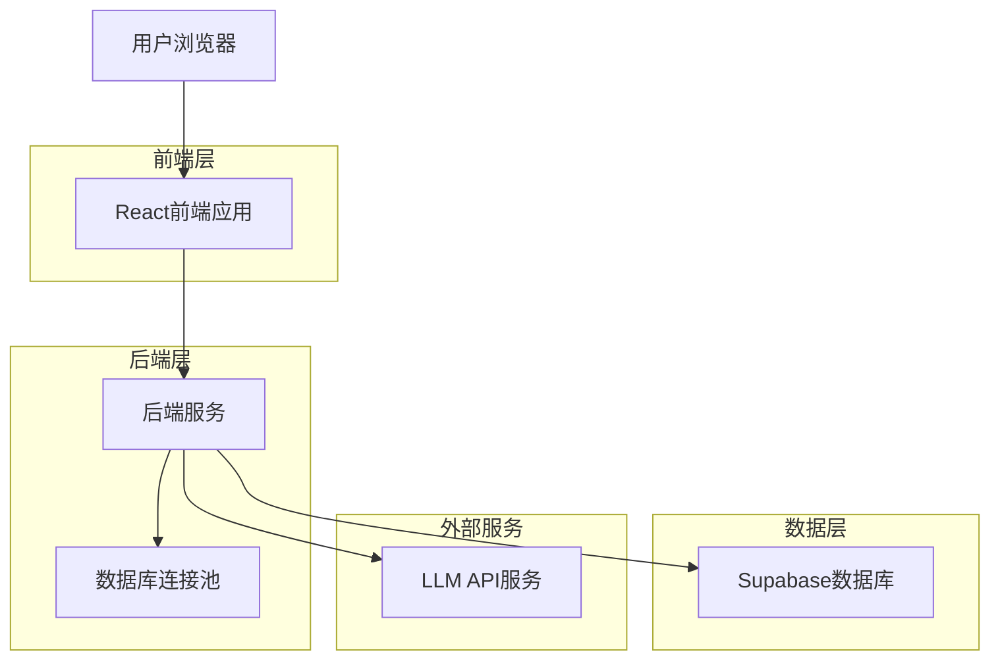
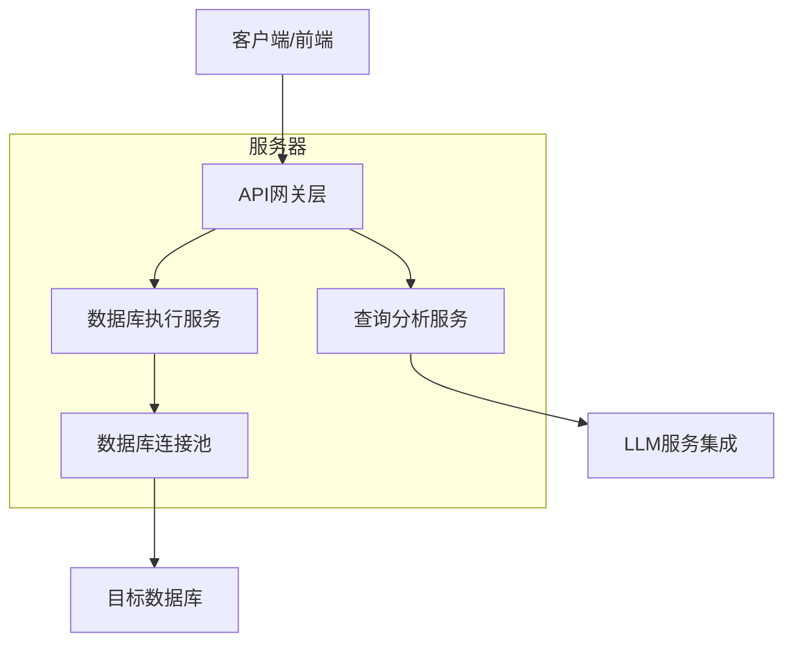
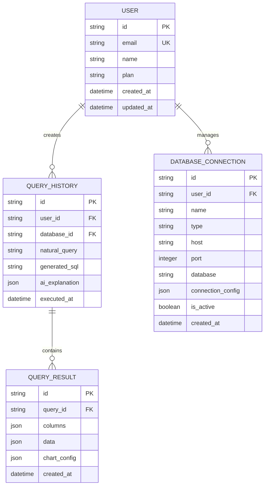

## 1. 架构设计



## 2. 技术描述

- **前端**: React@18 + TypeScript + TailwindCSS@3 + Vite
- **初始化工具**: vite-init
- **后端**: Express@4 + Node.js
- **数据库**: Supabase (PostgreSQL)
- **图表库**: ECharts@5
- **代码编辑器**: Monaco Editor
- **UI组件库**: HeadlessUI + Radix UI

## 3. 路由定义

| 路由 | 用途 |
|------|------|
| / | 首页，重定向到查询页面 |
| /query | 查询页面，自然语言输入和AI对话 |
| /result/:id | 结果展示页面，显示SQL、数据、图表 |
| /history | 查询历史页面（高级用户功能） |

## 4. API定义

### 4.1 核心API

**自然语言查询分析**
```
POST /api/query/analyze
```

请求:
| 参数名 | 参数类型 | 是否必需 | 描述 |
|--------|----------|----------|------|
| databaseId | string | true | 数据库连接ID |
| query | string | true | 自然语言查询描述 |
| context | array | false | 对话上下文历史 |

响应:
| 参数名 | 参数类型 | 描述 |
|--------|----------|------|
| sql | string | 生成的SQL语句 |
| explanation | string | AI对查询的解释 |
| suggestions | array | 改进建议或澄清问题 |
| confidence | number | 置信度分数 |

示例:
```json
{
  "databaseId": "db_123",
  "query": "显示去年各月份的销售额趋势",
  "context": []
}
```

**执行查询并获取数据**
```
POST /api/query/execute
```

请求:
| 参数名 | 参数类型 | 是否必需 | 描述 |
|--------|----------|----------|------|
| databaseId | string | true | 数据库连接ID |
| sql | string | true | SQL查询语句 |

响应:
| 参数名 | 参数类型 | 描述 |
|--------|----------|------|
| columns | array | 列名数组 |
| data | array | 数据行数组 |
| chartConfig | object | ECharts配置对象 |

**获取数据库连接列表**
```
GET /api/databases
```

响应:
```json
[
  {
    "id": "db_123",
    "name": "销售数据库",
    "type": "postgresql",
    "host": "localhost",
    "port": 5432,
    "database": "sales_db"
  }
]
```

## 5. 服务器架构图



## 6. 数据模型

### 6.1 数据模型定义



### 6.2 数据定义语言

**用户表 (users)**
```sql
-- 创建表
CREATE TABLE users (
    id UUID PRIMARY KEY DEFAULT gen_random_uuid(),
    email VARCHAR(255) UNIQUE NOT NULL,
    name VARCHAR(100) NOT NULL,
    plan VARCHAR(20) DEFAULT 'free' CHECK (plan IN ('free', 'premium')),
    created_at TIMESTAMP WITH TIME ZONE DEFAULT NOW(),
    updated_at TIMESTAMP WITH TIME ZONE DEFAULT NOW()
);

-- 创建索引
CREATE INDEX idx_users_email ON users(email);
CREATE INDEX idx_users_plan ON users(plan);
```

**数据库连接表 (database_connections)**
```sql
-- 创建表
CREATE TABLE database_connections (
    id UUID PRIMARY KEY DEFAULT gen_random_uuid(),
    user_id UUID NOT NULL REFERENCES users(id) ON DELETE CASCADE,
    name VARCHAR(100) NOT NULL,
    type VARCHAR(20) NOT NULL CHECK (type IN ('postgresql', 'mysql', 'sqlite')),
    host VARCHAR(255) NOT NULL,
    port INTEGER NOT NULL,
    database VARCHAR(100) NOT NULL,
    connection_config JSONB,
    is_active BOOLEAN DEFAULT true,
    created_at TIMESTAMP WITH TIME ZONE DEFAULT NOW(),
    updated_at TIMESTAMP WITH TIME ZONE DEFAULT NOW()
);

-- 创建索引
CREATE INDEX idx_db_connections_user_id ON database_connections(user_id);
CREATE INDEX idx_db_connections_active ON database_connections(is_active);
```

**查询历史表 (query_history)**
```sql
-- 创建表
CREATE TABLE query_history (
    id UUID PRIMARY KEY DEFAULT gen_random_uuid(),
    user_id UUID NOT NULL REFERENCES users(id) ON DELETE CASCADE,
    database_id UUID NOT NULL REFERENCES database_connections(id) ON DELETE CASCADE,
    natural_query TEXT NOT NULL,
    generated_sql TEXT NOT NULL,
    ai_explanation JSONB,
    executed_at TIMESTAMP WITH TIME ZONE DEFAULT NOW()
);

-- 创建索引
CREATE INDEX idx_query_history_user_id ON query_history(user_id);
CREATE INDEX idx_query_history_database_id ON query_history(database_id);
CREATE INDEX idx_query_history_executed_at ON query_history(executed_at DESC);
```

**查询结果表 (query_results)**
```sql
-- 创建表
CREATE TABLE query_results (
    id UUID PRIMARY KEY DEFAULT gen_random_uuid(),
    query_id UUID NOT NULL REFERENCES query_history(id) ON DELETE CASCADE,
    columns JSONB NOT NULL,
    data JSONB NOT NULL,
    chart_config JSONB,
    created_at TIMESTAMP WITH TIME ZONE DEFAULT NOW()
);

-- 创建索引
CREATE INDEX idx_query_results_query_id ON query_results(query_id);
```

### 6.3 权限配置

```sql
-- 基本读取权限
GRANT SELECT ON users TO anon;
GRANT SELECT ON database_connections TO anon;
GRANT SELECT ON query_history TO anon;
GRANT SELECT ON query_results TO anon;

-- 完整权限
GRANT ALL PRIVILEGES ON users TO authenticated;
GRANT ALL PRIVILEGES ON database_connections TO authenticated;
GRANT ALL PRIVILEGES ON query_history TO authenticated;
GRANT ALL PRIVILEGES ON query_results TO authenticated;
```